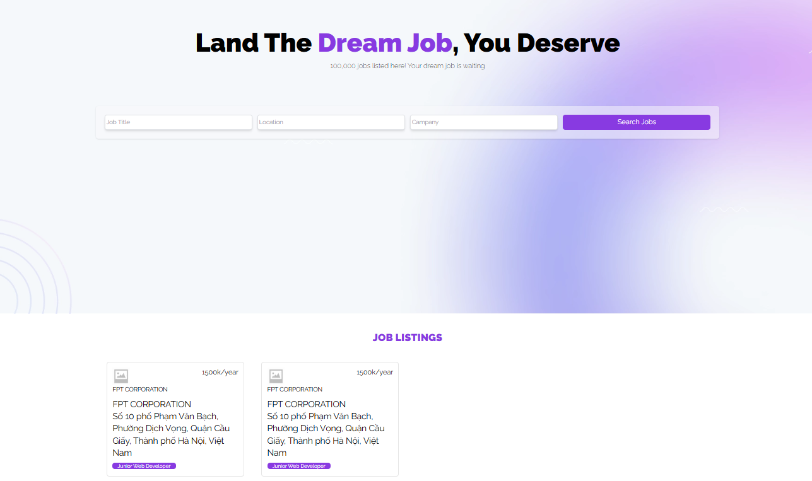
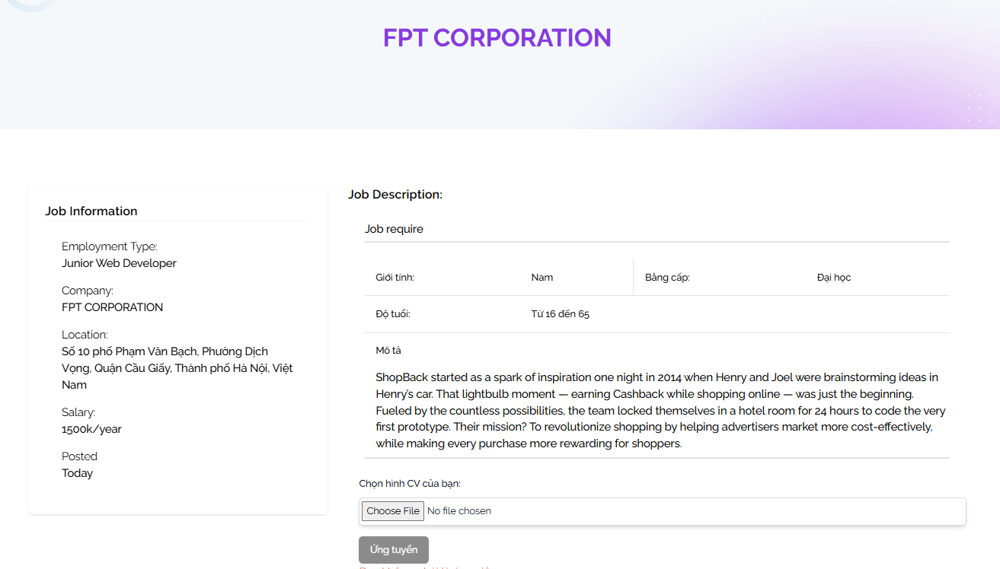
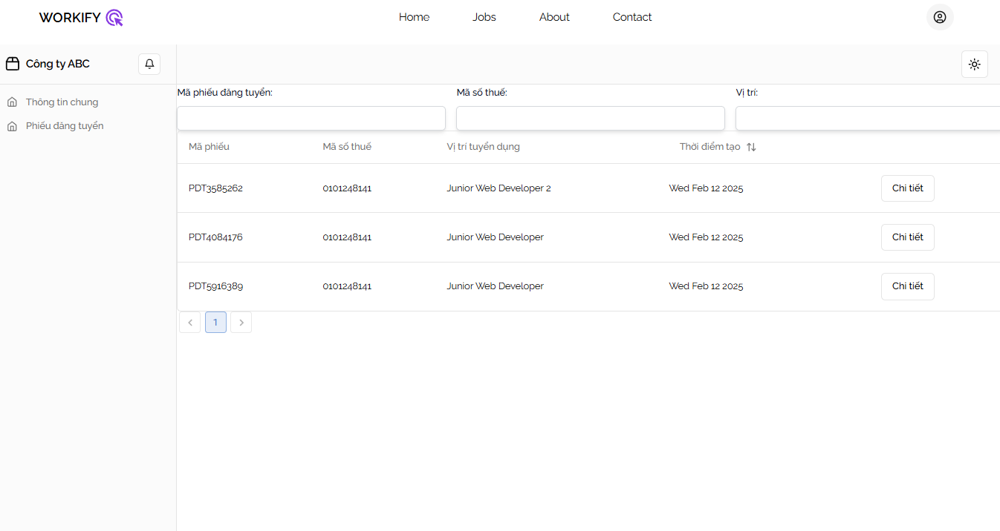
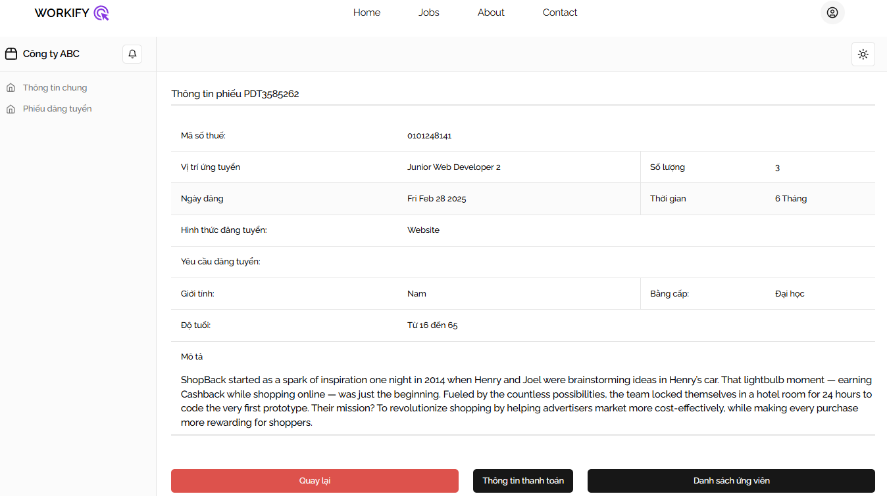
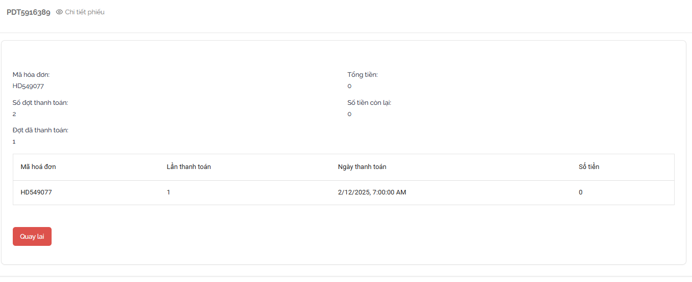

# Joblisting with Nextjs and Prisma ORM and PostgreSQL. 
## To run : 
npx prisma db push 

npx prisma generate 

npm run dev

default run on localhost:3000 :>

Have fun

## Demo images

### Landing page

### Detail Job

### Company 

1. Company info

2. List of joblisting

3. Detail job

4. Payment detail
